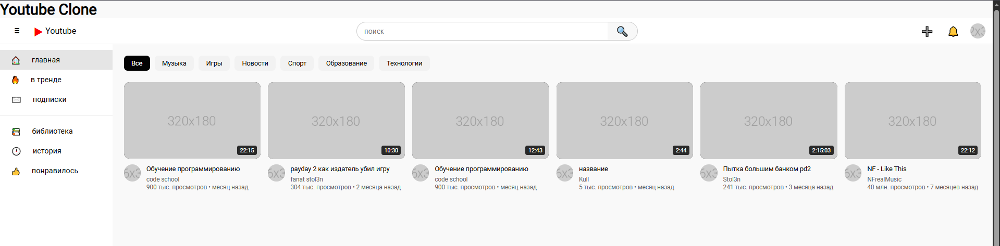
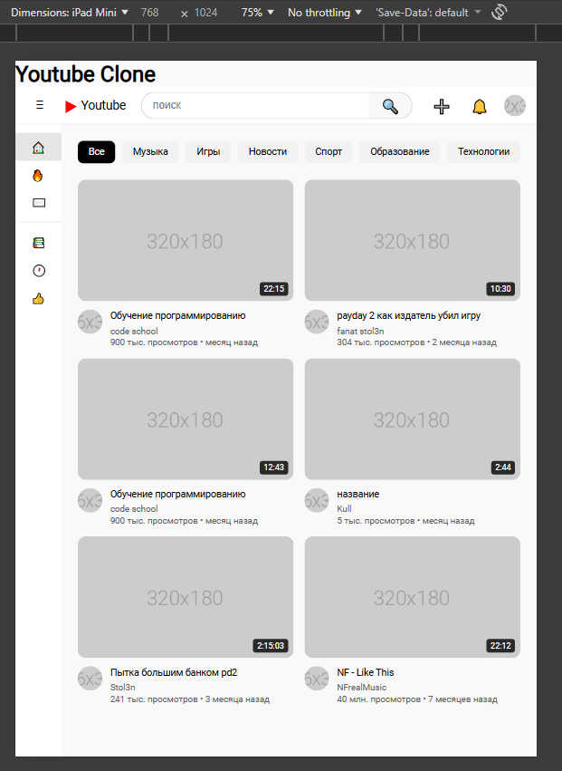

# YouTube Clone - Лабораторная работа №9-10
**Студент:**
[Уютов Павел Александрович] 
**Группа:**
[ИСП-231]
## Описание
Это простая демонстрационная страница, имитирующая интерфейс популярного видеосервиса YouTube. Проект включает адаптивный дизайн, который корректно отображается на различных устройствах, а также содержит основные компоненты, такие как шапка, боковая панель, фильтры и видеокарточки.
## Реализованные функции
- [] Адаптивный хедер с поиском
- [] Боковая панель навигации
- [] Категории (чипсы) с интерактивностью
- [] Сетка видео с карточками
- [] Hover-эффекты на карточках
- [] Полная адаптивность под все устройства
- [] [Добавьте свои функции]
## Технологии- HTML5- CSS3- Fl
exbox- C
SS Grid- M
edia Queries--
## Скриншоты
### Desktop (1920px)

### Tablet (1024px)

### Mobile (375px)

## Как запустить
1. Откройте файл `index.html`в браузере
2. Или используйте  **Live Server**- Установите расширение Live Server- Правой кнопкой по ` в VS Code: index.html` → Open with Live Server--
## Структура проекта
## Вывод
В ходе выполнения лабораторной работы я научился создавать адаптивный дизайн с помощью медиа-запросов, освоил основы структурирования веб-страниц с использованием HTML и CSS. Я познакомился с принципами организации интерфейса, такими как навигационные панели, карточки видео и фильтры. Этот проект помог мне лучше понять, как разрабатывать удобные и красивый интерфейсы, которые адаптируются под разные устройства и размеры экранов.
## Дата выполнения
[16.04.2026]